# TrackerKit Pipeline Schematics

Walkthrough of how a video becomes a labeled trajectory CSV. Six diagrams,
top-down: the global pipeline first, then each major stage. Diagrams use
Mermaid — render in any markdown viewer that supports it (GitHub, VS Code,
mkdocs-material, Obsidian).

Legend (used throughout):

- **Solid blocks** = required steps.
- **Dashed blocks** = optional / config-gated.
- **Cylinders / parenthesized nodes** = on-disk artifacts (`.npz`, CSV) or
  data records.
- **Hexagons / pills** = entry / exit points.

---

## 1 · Overall pipeline

End-to-end flow from "user clicks Run" to the final CSV. The forward pass
runs in **one of three modes** depending on whether individual analysis
(pose / tag / CNN) is configured and whether the user forces a precompute
rebuild — that mode decision (in `worker.py:1028–1148`) is what determines
*when* and *where* the per-detection inference happens. Backward,
fragment-solving, merging, and post-processing are mode-agnostic.

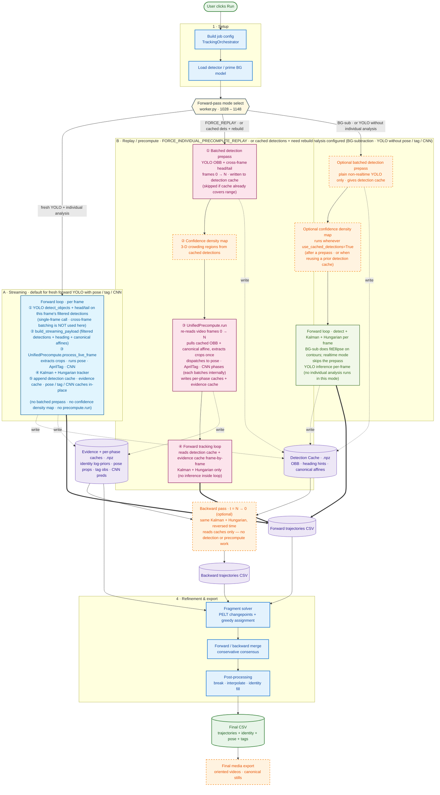

**Mode selector — what triggers each lane**

| Lane | Triggered when | Pre-tracking inference | Density map built? |
|---|---|---|---|
| **A · Streaming** | `individual_data_precompute_enabled` ∧ `not _force_individual_replay` ∧ `not use_cached_detections` ∧ not preview/backward | None — detection (with heading) and pose/tag/CNN all run *inside* the forward loop | ❌ no (cache filled as we go; never reaches the `use_cached_detections` branch that builds it) |
| **B · Replay / precompute** | `FORCE_INDIVIDUAL_PRECOMPUTE_REPLAY=True`, **or** streaming requested but detections are already cached and individual phases need (re)building | **Two prepasses**: ① batched detection (OBB + heading) → `DetectionCache`, then ② `UnifiedPrecompute.run` (pose + tag + CNN) → per-phase + evidence caches | ✅ yes (between ① and ③, gated on `use_cached_detections`) |
| **C · Plain online** | No individual analysis configured (`ENABLE_POSE_EXTRACTOR`, `USE_APRILTAGS`, `CNN_CLASSIFIERS` all empty) — covers BG-subtraction and bare YOLO. Realtime mode lands here too only when *also* no individual analysis is configured (otherwise realtime + individual analysis routes to Lane A). | Only the optional batched detection prepass for plain non-realtime YOLO; never any individual-analysis prepass | ✅ optional · runs whenever `use_cached_detections=True` (after a prepass, or when reusing a prior detection cache) |

**Key code paths (for verification)**

- Mode flags computed: `worker.py:1028` (`use_batched_detection`),
  `worker.py:1075` (`individual_data_precompute_enabled`),
  `worker.py:1096` (`streaming_precompute_enabled`).
- Streaming disables batched prepass: `worker.py:1107–1112`.
- Replay forces batched prepass: `worker.py:1142–1148`.
- Phase 1 batched detection: `worker.py:1373–1395` →
  `tracking/detection_phase.py:227 run_batched_detection_phase` (writes
  OBB + heading only).
- Confidence density map: `worker.py:1413–1418` (gated on
  `use_cached_detections`).
- Phase 2 `UnifiedPrecompute.run`: `worker.py:1801–1820`,
  `tracking/precompute.py:730`.
- Phase 3 forward tracking loop: `worker.py:2400+` (uses cached
  detections; in streaming mode this same loop also dispatches
  `live_feature_precompute.process_live_frame` at `worker.py:2799–2844`).
- Cached detection writes inside forward loop: `worker.py:2724–2739`.

---

## 2 · Detection methods & preprocessing

Two detector families share a common downstream filter and a common output
schema. The choice is per-job (`DETECTION_METHOD`); the rest of the pipeline
does not care which produced the detections.

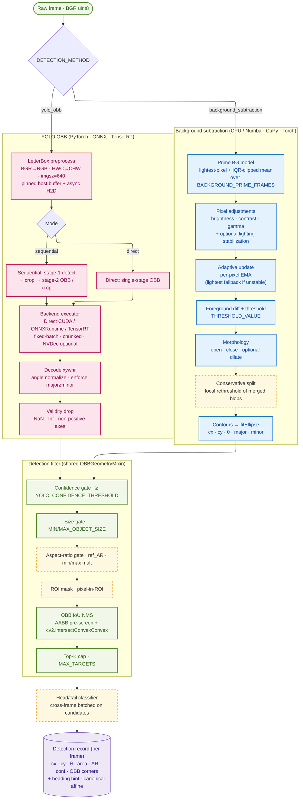

**Notes for newcomers**

- Background subtraction is the lightweight default — fast, no model, but
  needs a relatively static background and well-tuned thresholds.
- YOLO OBB ("oriented bounding box") gives a confidence-scored rotated
  rectangle per animal and supports three deployment runtimes; the same
  filter cascade follows either path.
- The Head/Tail classifier is a separate small CNN that runs *after*
  filtering, only on detections that are likely to be kept — its job is to
  break the 180° axis ambiguity (does the head point left or right?).

---

## 3 · Individual-level methods

Per detection, we build a **canonical crop** (centered, rotated, head-up)
and run three independent analyses on it: pose, CNN classification, and
AprilTag. CNN log-posteriors (only from classifiers flagged as identity
providers) and AprilTag log-priors are emitted as `IdentityEvidence` —
the per-slot Bayesian fusion that consumes them runs in the **online
tracker** (Section 4), not here.

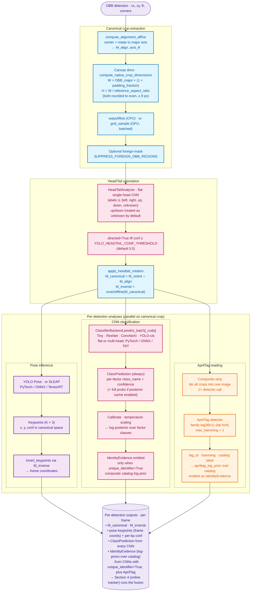

**Notes for newcomers**

- **Canonical crop** = the animal cut out of the frame, rotated so the body
  axis is horizontal and (after head/tail) the head points right. Every
  downstream model sees animals in the same canonical pose, which makes
  small CNNs work well.
- **"Identity" vs "non-identity" classifiers — a flag, not a mode.** Every
  CNN goes through the *same* code path: `ClassifierBackend.predict_batch`
  → `ClassPrediction` (per-factor class names + confidences). What
  changes is a per-classifier config flag — `CNN_CLASSIFIERS[i].unique_identifier`
  (read at `worker.py:1890`). When **True**, the calibrated log-posterior
  is emitted as `IdentityEvidence` and feeds the identity decoder. When
  **False** (e.g., a "color" or "phenotype" classifier), the predictions
  are still produced and cached, but they are skipped during identity
  fusion (`worker.py:3079`). **There is no embedding-only / catalog-free
  path in the codebase** — all CNNs produce class predictions, period.
- **AprilTags** act as a near-deterministic identity prior: when read
  successfully they almost pin the per-slot posterior; otherwise they
  contribute nothing.
- **The Bayesian fusion** (sticky Markov transition, soft slot-lock,
  pairwise swap detector, uniqueness Hungarian) lives in
  `OnlineIdentityDecoder` and runs **per track slot** during tracking
  — see Section 4.

---

## 4 · Online tracking algorithm

Per-frame loop in `worker.py:2400-3850`. The cost matrix integrates **four
families of cues** (motion, orientation, shape, identity) plus optional
pose / density overlays. Hungarian assignment runs in three phases
(established → young → respawn). The identity decoder runs **after**
Hungarian and lifecycle updates — its output feeds the *next* frame's
cost matrix, closing a frame-to-frame feedback loop.

```mermaid
flowchart TB
    classDef kf     fill:#e1f5fe,stroke:#01579b,stroke-width:2px
    classDef cost   fill:#fff3e0,stroke:#e65100,stroke-width:2px
    classDef assign fill:#fce4ec,stroke:#880e4f,stroke-width:2px
    classDef ident  fill:#e8f5e9,stroke:#1b5e20,stroke-width:2px
    classDef life   fill:#f3e5f5,stroke:#4a148c,stroke-width:2px
    classDef io     fill:#ede7f6,stroke:#5e35b1,stroke-width:1.5px

    Frame([Frame t]):::io

    subgraph KP[" ① Kalman predict (per active track) "]
        K1["State x = (x, y, θ, vx, vy)<br/>F: const-θ · v ← DAMPING · v  (default 0.95)<br/>Q anisotropic: q_long ≫ q_lat<br/>rotated into body frame via heading θ"]:::kf
        K2["Innovation cov S<br/>+ adaptive jitter (∝ trace of position block)<br/>+ max-velocity innovation clip<br/>Joseph-form covariance update"]:::kf
        K3["Maturity-attenuated velocity<br/>young tracks (age &lt; KALMAN_MATURITY_AGE):<br/>retention ramps from KALMAN_INITIAL_VELOCITY_RETENTION → 1.0"]:::kf
    end

    Det["② Detections + per-detection features<br/>(cx, cy, θ, area, AR, pose, IdentityEvidence)<br/>from Section 3"]:::cost

    subgraph CM[" ③ Cost matrix C[i, j] = track i × det j "]
        direction TB
        C1["Position · Mahalanobis<br/>√(Δᵀ S⁻¹ Δ) · per-track adaptive radius gate"]:::cost
        C2["Orientation · |Δθ|<br/>directed → π-wrap · undirected → ½-wrap (axis-only)"]:::cost
        C3["Shape · |Δarea| + |Δaspect|"]:::cost
        C4["Identity · −log P(det_id | track posterior_{t−1})<br/>uses prev-frame posterior — feedback loop"]:::cost
        C5["Pose rejection · per-keypoint MAD veto<br/>hard-block on excess pose distance"]:::cost
        C6["Density gate · 0.7× MAX_DIST in confidence-density regions"]:::cost
        C7[("Weighted sum<br/>Wp·d + Wo·Δθ + Wa·Δarea + Wasp·Δaspect<br/>+ ASSOCIATION_IDENTITY_HINT_SCALE · id_cost")]:::cost
    end

    subgraph AS[" ④ Hungarian assignment (3 phases · `assign_tracks`) "]
        A1["Phase 1 · Established (continuity ≥ MATURITY_AGE)<br/>linear_sum_assignment on full cost"]:::assign
        A2["Phase 2 · Young (continuity &lt; MATURITY_AGE)<br/>greedy nearest"]:::assign
        A3["Phase 3 · Respawn lost slots<br/>committed-identity log-likelihood first<br/>→ proximity fallback (motion-budget gate)"]:::assign
    end

    subgraph LF[" ⑤ Lifecycle update "]
        L1["active → occluded → lost<br/>(missed_frames vs LOST_THRESHOLD_FRAMES)"]:::life
        L2["Track birth · unmatched det → free lost slot<br/>hard KF reset · zero velocity · new trajectory_id"]:::life
        L3["Identity-aware respawn · committed slot rejoin<br/>soft KF reset · preserves trajectory_id"]:::life
    end

    subgraph ID[" ⑥ OnlineIdentityDecoder · per slot "]
        I1["Predict · sticky Markov<br/>diag = 1−ε  off-diag = ε / (C−1)<br/>ε ≈ IDENTITY_TRANSITION_EPSILON (0.02)"]:::ident
        I2["Fuse · log-add CNN + AprilTag evidences · renormalize"]:::ident
        I3["Swap detector · pairwise mutual-mismatch<br/>counter ≥ IDENTITY_SWAP_MIN_FRAMES (8)<br/>margin ≥ IDENTITY_SWAP_CONF_MARGIN (0.2)"]:::ident
        I4["Soft slot-lock · stable_count ≥ IDENTITY_SLOT_LOCK_MIN_FRAMES (30)<br/>biases posterior toward locked label"]:::ident
        I5["Uniqueness Hungarian<br/>N×(K identities + N dummy 'unassigned')"]:::ident
        I6["Commit · conf ≥ IDENTITY_COMMIT_THRESHOLD (0.85)<br/>∧ hits ≥ IDENTITY_COMMIT_MIN_HITS (5)"]:::ident
    end

    U1["⑦ Kalman correct<br/>z = (x, y, θ); Joseph-form update"]:::kf
    Em([⑧ Emit per-track row · state · pos · heading · identity · pose]):::io

    Frame --> K1 --> K2 --> K3 --> Det
    Det --> C1 --> C2 --> C3 --> C4 --> C5 --> C6 --> C7
    C7 --> A1 --> A2 --> A3
    A3 --> L1 --> L2 --> L3
    L3 --> I1 --> I2 --> I3 --> I4 --> I5 --> I6
    I6 --> U1 --> Em

    %% Frame-to-frame feedback
    I6 -. "posterior at t · used as prior at t+1" .-> C4
```

**Key code references**

- Kalman state, transition, anisotropic Q: `core/filters/kalman.py:21-42, 210, 256-281`.
- Maturity-attenuated velocity: `kalman.py:406-436`.
- Joseph-form update + jitter + innovation clip: `kalman.py:126-178`.
- Cost matrix construction: `core/assigners/hungarian.py:71-103, 223-271, 285-348`.
- Density gate (0.7×): `worker.py:3165-3187`.
- 3-phase `assign_tracks`: `hungarian.py:901-1018`; committed-identity respawn at `794-862`.
- Identity decoder: `core/identity/online.py:148+` (sticky transition `203-208`, fuse `333-351`, swap `667-729`, slot-lock `653-659`, uniqueness Hungarian `515-551`, commit `590-597`).
- State management: `worker.py:3288-3295`.
- Identity decoder invocation: `worker.py:3301-3529` (`update_frame(visible_slots, slot_evs)`).
- Track birth (hard reset): `worker.py:3561-3582`; identity-aware respawn (soft reset): `worker.py:3583-3596`.

**Notes for newcomers**

- The Kalman state has **no rotational velocity**; we only damp linear
  velocity. Anisotropic process noise (much larger forward than lateral)
  encodes the prior that animals tend to move along their body axis.
- The cost matrix is *additive* — every cue is a non-negative penalty,
  weighted, then summed. Identity is a *log-likelihood penalty* using
  the **previous** frame's posterior, so a detection that strongly
  disagrees with a track's running identity belief gets pushed away
  even if the geometry is fine. The dotted feedback arrow shows this.
- **Three-phase assignment** matters: established tracks pick first
  (Hungarian), young tracks fill in greedily, lost tracks get a final
  rescue pass that uses *committed identity* before falling back to
  proximity — this is what fixes ID switches around occlusions.
- **Hard vs. soft reset on respawn:** a brand-new track gets a fresh
  `trajectory_id`. A *committed* lost track that the identity decoder
  rejoins keeps its `trajectory_id`, so the trajectory continues
  unbroken through the gap.

---

## 5 · Post-tracking pipeline · per-direction cleanup, merge, identity solve

Each direction's raw trajectory CSV gets cleaned **independently** before
the two are merged. The merge worker runs `resolve_trajectories` →
`interpolate` → tag identity → rescale in one block. The fragment solver
runs much later, during the rich-export build — *after* the merged CSV is
already written.

```mermaid
flowchart TB
    classDef fwd   fill:#e1f5fe,stroke:#0277bd,stroke-width:2px,color:#01579b
    classDef bwd   fill:#fff3e0,stroke:#ef6c00,stroke-width:2px,color:#e65100
    classDef pp    fill:#fff8e1,stroke:#f57c00,stroke-width:2px,color:#bf360c
    classDef cache fill:#ede7f6,stroke:#5e35b1,stroke-width:1px,color:#311b92
    classDef merge fill:#e8f5e9,stroke:#2e7d32,stroke-width:2px,color:#1b5e20
    classDef rich  fill:#fce4ec,stroke:#c2185b,stroke-width:2px,color:#880e4f
    classDef io    fill:#e8f5e9,stroke:#2e7d32,stroke-width:2.5px,color:#1b5e20

    Vid([Video]):::io

    DC[("Detection cache · .npz\nOBB · heading · canonical affines")]:::cache
    EC[("Evidence cache · .npz\nper-source log-priors\n+ catalog · calibration sig")]:::cache

    subgraph FwdP[" ① Forward pass · t = 0 → N "]
        F1[Online tracker\nKalman + Hungarian]:::fwd
        F2["Raw forward CSV\n_forward.csv"]:::fwd
        F1 --> F2
    end

    subgraph PPF[" ② PostProcessWorker · forward "]
        PF1["process_trajectories_from_csv\nbreak short tracks · velocity breaks\nocclusion-gap splits"]:::pp
        PF2["_forward_processed.csv"]:::pp
        PF1 --> PF2
    end

    subgraph BwdP[" ③ Backward pass · t = N → 0  (optional) "]
        B1["Online tracker · reversed time\nreads detection + evidence caches"]:::bwd
        B2["Raw backward CSV\n_backward.csv"]:::bwd
        B1 --> B2
    end

    subgraph PPB[" ④ PostProcessWorker · backward "]
        PB1["process_trajectories_from_csv\nsame per-direction cleanup"]:::pp
        PB2["_backward_processed.csv"]:::pp
        PB1 --> PB2
    end

    subgraph MW[" ⑤ MergeWorker.execute  (only if backward enabled) "]
        direction TB
        subgraph RT[" resolve_trajectories  (conservative consensus) "]
            direction TB
            R1["Find merge candidates\ndistance ≤ AGREEMENT_DISTANCE 15px\noverlap ≥ MIN_OVERLAP_FRAMES 5"]:::merge
            R2["Apply candidates · conservative\naverage where agree · split where disagree\nidentity-disagree split run ≥ 5"]:::merge
            R3["Spatial dedup #1\ndrop trajectories &gt; 70% contained in another"]:::merge
            R4[Merge overlapping agreeing fragments]:::merge
            R5["Stitch broken fragments\ngap ≤ STITCH_MAX_GAP_FRAMES 3\ndistance ≤ 2× AGREEMENT_DISTANCE"]:::merge
            R6["Spatial dedup #2  (post-stitch)"]:::merge
            R7["resolve_simultaneous_identity_conflicts\nclaim score = 1.5·tag_votes +\nagreement·confidence·length"]:::merge
            R8[Reassign trajectory IDs]:::merge
            R1 --> R2 --> R3 --> R4 --> R5 --> R6 --> R7 --> R8
        end
        I1["interpolate_trajectories\nfill gaps ≤ max_gap · sin/cos heading\nflip-burst correction"]:::merge
        I2["_resolve_tag_identities\nper-frame nearest tag ≤ TAG_ASSOCIATION_RADIUS 50px\nmajority vote · detect_tag_swaps"]:::merge
        I3["_rescale_coordinates\nX, Y, Width, Height ÷ resize_factor"]:::merge
        R8 --> I1 --> I2 --> I3
    end

    MergedCSV[("Merged final CSV\n_final.csv")]:::cache

    subgraph RX[" ⑥ Rich-export build  (_build_rich_export_dataframe) "]
        direction TB
        X1[Join with pose / CNN / tag caches]:::rich
        X2["run_fragment_solver  (gated on ENABLE_IDENTITY_FRAGMENT_SOLVER)\nPELT changepoint detection on per-trajectory CNN probs\niterative greedy assignment CNN 0.40 + tag 0.15 + prior 0.25\n+ log-length factor · spatial-velocity veto\nunknown-rescue pass"]:::rich
        X3["fill_identity_nans_with_consensus\nper-trajectory mode"]:::rich
        X4["sort_trajectories_by_identity\nrenumber TrajectoryID"]:::rich
        X1 --> X2 --> X3 --> X4
    end

    Out(["Final outputs\n_final.csv · _with_individual.csv"]):::io

    Vid --> F1
    F1 -. write .-> DC
    F1 -. write .-> EC
    F2 --> PF1
    DC --> B1
    EC --> B1
    B2 --> PB1
    PF2 --> R1
    PB2 --> R1
    I3 --> MergedCSV
    MergedCSV --> X1
    X4 --> Out
    PF2 -. "if backward disabled" .-> MergedCSV
```

**Notes for newcomers**

- **The per-direction post-processing is not optional.** Every raw
  trajectory CSV (forward or backward) goes through `PostProcessWorker`
  before it's eligible for merging. This is what splits trajectories at
  velocity jumps and occlusion gaps and drops anything below
  `MIN_TRAJECTORY_LENGTH`.
- **Conservative merging** = where forward and backward agree spatially
  *and* on identity, we average. Where they disagree, we **split** into
  separate fragments rather than guessing. The stitch step then reconnects
  fragments separated by short gaps.
- **The fragment solver runs late.** It is not a merge step — it operates
  on the *already-merged* trajectories during rich-export build, doing
  PELT changepoint detection on per-trajectory CNN probabilities to
  re-assign labels to identity-stable segments. This is also where
  `ENABLE_IDENTITY_FRAGMENT_SOLVER` is gated.
- **Forward-only runs skip the merge worker entirely.** Interpolation and
  rescaling happen directly in `_handle_forward_tracking_done`
  (`tracking.py:2344-2425`), and the post-processed forward CSV is
  promoted directly to the merged-CSV slot before rich export.

**Key code references (for verification)**

- Per-direction cleanup: `core/post/processing.py:process_trajectories_from_csv`
  invoked by `gui/workers/postprocess_worker.py:PostProcessWorker.execute`.
- Merge entry: `gui/workers/merge_worker.py:MergeWorker.execute` (lines
  141-216).
- `resolve_trajectories`: `core/post/processing.py:1008-1178`
  (find candidates → apply → dedup → merge overlap → stitch → dedup →
  identity conflict resolve → reassign IDs).
- Identity-conflict claim score: `processing.py:1192-1265` (`_CLAIM_TAG_WEIGHT
  = 1.5`, `_claim_features`, `_claim_score`).
- Interpolation: `processing.py:interpolate_trajectories` (called at
  `merge_worker.py:185`).
- Tag identity: `core/post/tag_identity.py:resolve_tag_identities,
  detect_tag_swaps` (called at `merge_worker.py:104-110`).
- Rich-export + fragment solver: `gui/orchestrators/tracking.py:3111-3175`
  → `core/identity/fragment_solver.py:run_fragment_solver` (line 1335);
  `core/post/identity_postprocess.py:fill_identity_nans_with_consensus,
  sort_trajectories_by_identity`.
- Forward-only short-circuit: `tracking.py:2344-2425` (`_handle_forward_tracking_done`).
- Forward + backward merge gate: `tracking.py:2472-2473`
  (`if has_forward and has_backward: self.merge_and_save_trajectories()`).

---

## 6 · Post-processing

Section 5 showed *when* each cleanup primitive runs in the orchestration.
This section drills into *how each one works internally* — the four
primitives that do all the trajectory-cleanup work in TrackerKit. There is
**no single "post-processing pipeline"** — these primitives are called
from different places (per-direction worker, merge worker, rich-export
build). Section 5 is the map; this is the deep-dive.

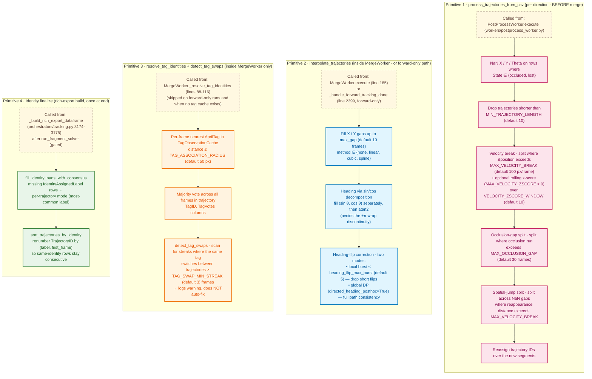

**What's not here (and why)**

- **`build_tag_only_trajectories`** (`tag_identity.py:332`) is defined but
  has **no call site** anywhere in the pipeline — dead code. The previous
  Section 6 listed it as "Tag-only fallback trajectories"; that step
  doesn't actually run.
- **`resolve_simultaneous_identity_conflicts`** is mapped in Section 5,
  not here, because it lives *inside* `resolve_trajectories` rather than
  as a standalone primitive — it always runs together with the conservative
  merge.
- **"Identity-disagreement split (committed run ≥ 5)"** is also a behaviour
  inside `_apply_merge_candidates` (Section 5), not a separate breaking
  step.
- **"Forward+backward fill of entropy / margin"** was invented by the old
  diagram — there is no such pipeline step.

**Notes for newcomers**

- **The four primitives execute on different schedules.** Primitive 1 runs
  twice (once per direction) before any merging. Primitives 2–3 run inside
  the merge worker (with primitive 2 also having a forward-only fast path).
  Primitive 4 runs once, very late, during rich-export build.
- **Sin/cos heading interpolation** is the trick that lets us interpolate
  through `θ = π` without blowing up: we treat heading as a 2-D vector
  `(sin θ, cos θ)`, interpolate each component, and take `atan2`.
- **Tag-swap detection is observational**, not corrective — it logs warnings
  for the user; it does not edit the trajectories.
- **AprilTag identity is a validator/tiebreaker**, not the primary signal.
  The CNN-based fragment solver (Section 5) is authoritative; tags only
  show up in the final CSV as `TagID` / `TagVotes` columns and as a
  scoring weight (`_CLAIM_TAG_WEIGHT = 1.5`) inside identity-conflict
  arbitration.
- **TrajectoryID renumbering** is purely cosmetic — same-identity rows
  end up consecutive in the CSV, which is convenient for downstream
  analysis but doesn't change any data.

**Final CSV columns (after all four primitives have run)**

| Column group | Source primitive | Notes |
|---|---|---|
| `FrameID`, `TrajectoryID`, `X`, `Y`, `Theta`, `State` | tracking + primitive 1 | `TrajectoryID` may be renumbered by primitive 4 |
| `IdentityAssignedLabel/ID/Confidence/Margin/Entropy` | tracking + fragment solver + primitive 4 | NaN rows filled by mode in primitive 4 |
| `IdentityCommitted`, `IdentityConflictResolved` | tracking + `resolve_simultaneous_identity_conflicts` | conflict flag set inside `resolve_trajectories` (Section 5) |
| `TagID`, `TagVotes` | primitive 3 | only populated when backward enabled and tag cache exists |
| `PoseKpt_*_X/Y/Conf` | rich-export join | from pose-properties cache |
| `Interpolated` | primitive 2 | `True` for synthetic frames produced by gap-fill |

---

## Reading order for the meeting

1. Show **diagram 1** to anchor the whole pipeline.
2. Drill into **diagram 2** (detection) to explain "where the OBBs come
   from".
3. **Diagram 3** (individual-level) is the key conceptual leap: canonical
   crops + three parallel analyses.
4. **Diagram 4** (online tracking) — this is the heart of the system; the
   cost matrix slide is the one to linger on.
5. **Diagram 5** (backward / forward) — explains why we have a two-pass
   architecture and how identity survives across the boundary.
6. **Diagram 6** (post) — short, mostly hygiene; closes the loop into the
   CSV.


# TrackerKit Pipeline — Lab Meeting Schematics

Seven slide-sized Mermaid diagrams. Each one is meant to fit on a single
slide. Detail and parameter values live in the supporting table under each
diagram — keep the visual on screen and read from the table when you need
specifics.

**To export:** paste any single ` ```mermaid ``` ` block into
<https://mermaid.live> → "Actions" → PNG/SVG. Or render in VS Code with
*Markdown Preview Mermaid Support*.

Color key:

- 🟢 green — input / output (video, CSV)
- 🔵 blue — required pipeline step
- 🟠 dashed orange — optional / config-gated
- 🟣 purple — on-disk artifact (cache, sidecar)

---

## Slide 1 · Pipeline overview

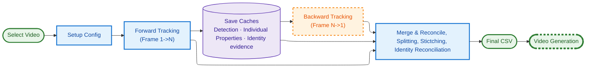

> The forward pass has three modes (next slide). Backward, fragment-solving,
> and post-processing are mode-agnostic — they all work off the caches.

---

## Slide 2 · Forward pass · three modes

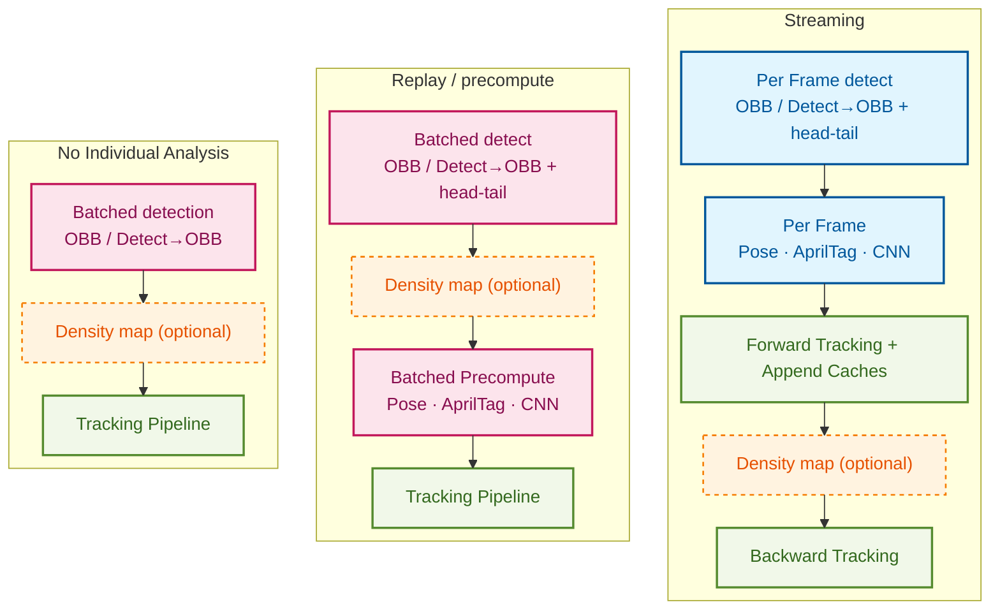

| Mode | Use when | What runs before tracking | Per-frame in tracking loop |
|---|---|---|---|
| **A · Streaming** | Fresh YOLO run with pose / tag / CNN configured | nothing | detect + head/tail + pose + tag + CNN + tracker |
| **B · Replay** | `FORCE_INDIVIDUAL_PRECOMPUTE_REPLAY=True`, or detection cache exists and individual phases need rebuild | batched detection → density map → `UnifiedPrecompute.run` | tracker only (reads caches) |
| **C · Plain** | No individual analysis configured (BG-sub, or YOLO without pose/tag/CNN) | optional batched detection | tracker (with detection if no prepass) |

---

## Slide 3 · Detection: two methods, shared filter

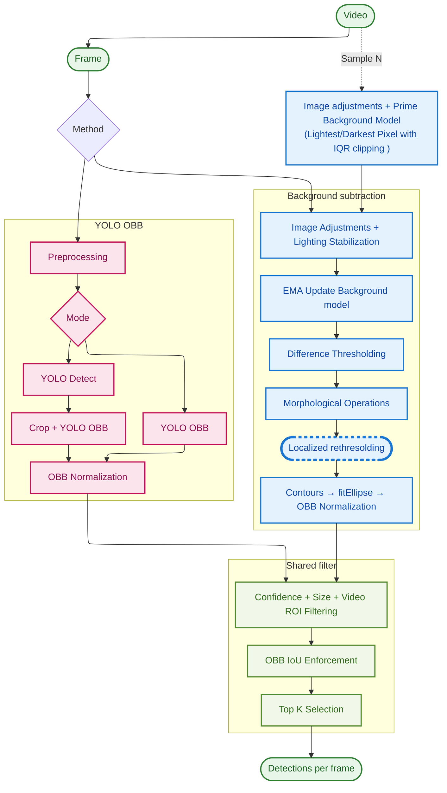

| Stage | Notes |
|---|---|
| BG prime | lightest-pixel + IQR-clipped mean over `BACKGROUND_PRIME_FRAMES` |
| BG update | per-pixel EMA (Numba / CuPy / Torch); morphology open + close |
| YOLO modes | Direct = 1-stage OBB · Sequential = detect → crop → OBB per crop |
| YOLO runtimes | PyTorch · ONNX · TensorRT (auto-export & cache) |
| Filter | `YOLO_CONFIDENCE_THRESHOLD`, `MIN/MAX_OBJECT_SIZE`, ROI mask, `YOLO_IOU_THRESHOLD`, `MAX_TARGETS` |
| Head/Tail | small CNN; resolves the 180° axis ambiguity (left/right/up/down/unknown) |

---

## Slide 4 · Per-detection processing

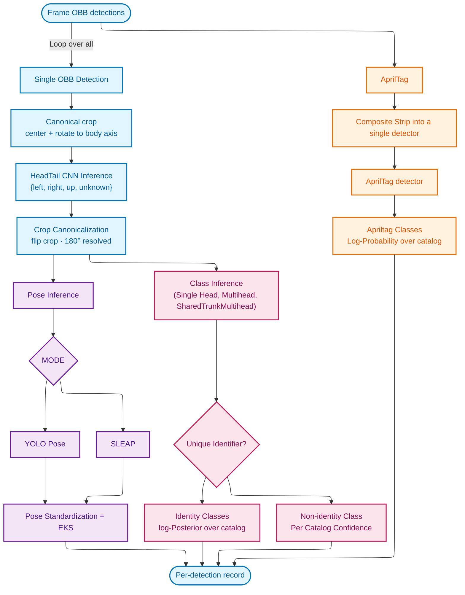

| Step | Output |
|---|---|
| Canonical crop | `M_canonical` (frame → crop) and `M_inverse` for back-mapping |
| Head/Tail | direction ∈ {left, right, up, down, unknown}; sets `directed=True` if confident |
| Pose | `K × 3` keypoints (x, y, confidence) in canonical space → mapped back via `M_inverse` |
| CNN identity | per-factor class + confidence (flat or multi-head); calibrated log-posterior |
| CNN embedding | penultimate features (used when no identity catalog) |
| AprilTag | tag id + Hamming distance via composite-strip detector |
| Identity fusion | log-add CNN + AprilTag, sticky Markov prior, per-slot Hungarian for uniqueness |

---

## Slide 5 · Online tracking · per-frame loop

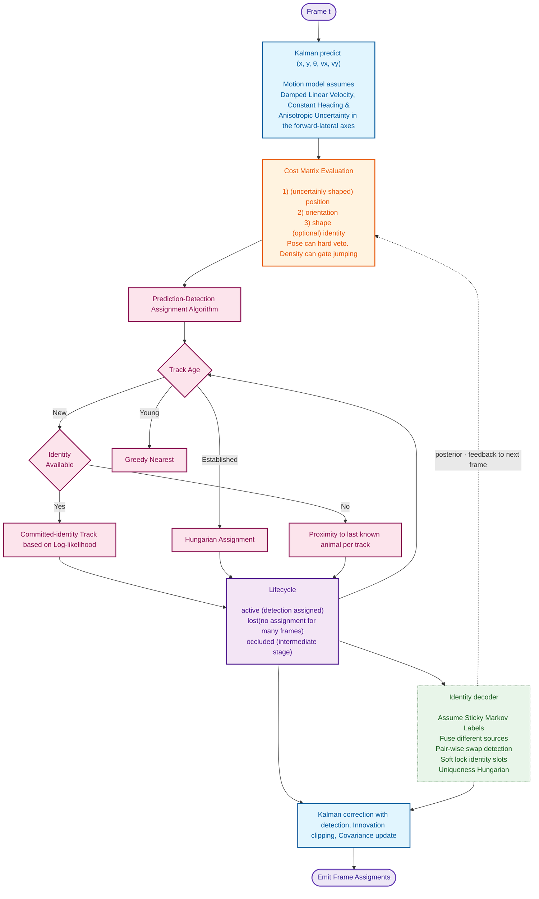

> The dotted arrow shows the **feedback loop**: the identity decoder's
> per-slot posterior at frame *t* becomes the prior used by frame *t + 1*'s
> cost matrix (via the `−log P(det_id ∣ track_posterior)` term).

| Stage | Detail |
|---|---|
| **① Predict** | State `[x, y, θ, vx, vy]`; F = const-θ + damped vel (`DAMPING=0.95`); Q anisotropic (q_long ≫ q_lat) rotated into body frame; young tracks have attenuated velocity retention until `KALMAN_MATURITY_AGE` |
| **② Cost matrix** | Additive penalty over all cues: `Wp · Mahalanobis + Wo · \|Δθ\| + Wa · \|Δarea\| + Wasp · \|Δaspect\| + id_scale · −log P(det_id ∣ posterior_{t-1})`. Pose-keypoint MAD veto (hard block); density gate (0.7× MAX_DIST in crowd regions); per-track adaptive radius gate |
| **③ Hungarian** | ① **Established** (continuity ≥ MATURITY_AGE) — `linear_sum_assignment` on full cost <br>② **Young** — greedy nearest <br>③ **Respawn lost slots** — committed-identity log-likelihood first, then proximity fallback |
| **④ Lifecycle** | `active → occluded → lost` (after `missed ≥ LOST_THRESHOLD_FRAMES`). Birth: hard KF reset, fresh `trajectory_id`. Identity-aware respawn: soft KF reset, **preserves** `trajectory_id` |
| **⑤ Identity decoder** | Sticky Markov (ε ≈ 0.02) → log-add CNN + AprilTag evidence → pairwise swap detector (≥ 8 frames) → soft slot-lock (after 30 stable frames) → uniqueness Hungarian over (K identities + N dummies) → commit (conf ≥ 0.85 ∧ hits ≥ 5) |
| **⑥ Correct + emit** | Measurement `z = [x, y, θ]`; Joseph-form covariance update; max-velocity innovation clip. Emit per-track row to forward CSV |

---

## Slide 6 · Post-tracking pipeline · per-direction cleanup → merge → rich export

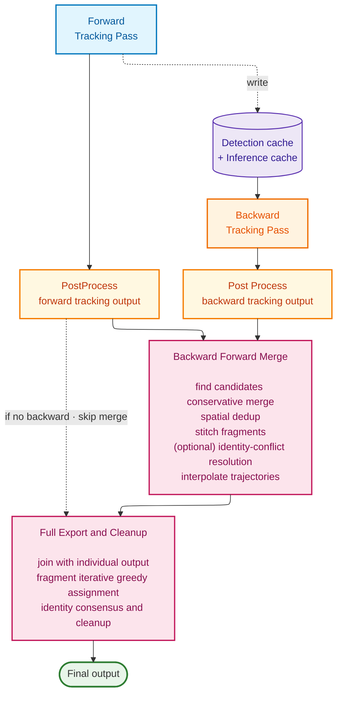

> Backward is optional. When disabled, the forward-processed CSV
> short-circuits straight into rich export (interpolate + rescale happen
> in the forward-only path before the merge slot).

| Stage | What actually runs |
|---|---|
| **① Forward tracker** | Online Kalman + Hungarian (Section 5). Writes detection + evidence caches as it goes. Emits raw `*_forward.csv` |
| **② PostProcess forward** | `process_trajectories_from_csv` — drops short tracks, breaks at velocity jumps, splits at occlusion / spatial gaps. → `*_forward_processed.csv` |
| **③ Backward tracker** | Same Kalman + Hungarian, reversed time. **Reads caches only** — no detection, no individual-analysis precompute |
| **④ PostProcess backward** | Identical primitive to ② — independent cleanup of the backward CSV |
| **⑤ MergeWorker** | `resolve_trajectories` (find candidates → conservative merge → spatial dedup → stitch → identity-conflict resolve → reassign IDs) → `interpolate_trajectories` → `_resolve_tag_identities` → `_rescale_coordinates`. Emits `*_final.csv` |
| **⑥ Rich-export build** | Join trajectory CSV with pose / CNN / tag caches → `run_fragment_solver` (PELT changepoints + iterative greedy assignment, gated on `ENABLE_IDENTITY_FRAGMENT_SOLVER`) → `fill_identity_nans_with_consensus` → `sort_trajectories_by_identity`. Emits `*_with_individual.csv` |

> **Conservative merge in plain English:** forward and backward
> trajectories that overlap spatially (≤ 15 px) for ≥ 5 frames *and* agree
> on identity get averaged; where they disagree they get **split** rather
> than guessed. Stitching reconnects fragments separated by short gaps
> (≤ 3 frames). The fragment solver runs **last**, on the merged CSV.

---

## Slide 7 · Cleanup primitives · how each one works

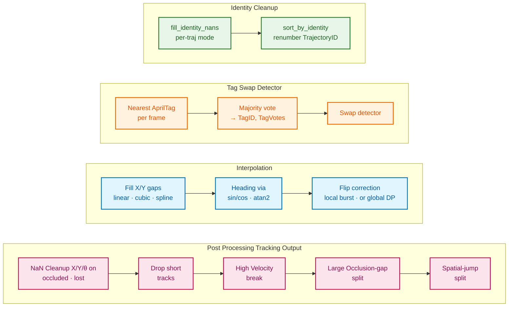

| Primitive | Called from | Key params (defaults) |
|---|---|---|
| **① process_trajectories_from_csv** | `PostProcessWorker.execute` (twice — once per direction, before merge) | `MIN_TRAJECTORY_LENGTH=10` · `MAX_VELOCITY_BREAK=100 px/frame` · `MAX_OCCLUSION_GAP=30` · optional `MAX_VELOCITY_ZSCORE` rolling window |
| **② interpolate_trajectories** | `MergeWorker.execute` (line 185) **or** `_handle_forward_tracking_done` (line 2399, forward-only) | `max_gap=10 frames` · `method ∈ {linear, cubic, spline, none}` · `heading_flip_max_burst=5` · `directed_heading_posthoc=False` (True → global DP correction) |
| **③ resolve_tag_identities + detect_tag_swaps** | `MergeWorker._resolve_tag_identities` (lines 88–116). Skipped on forward-only and when no tag cache exists | `TAG_ASSOCIATION_RADIUS=50 px` · `TAG_SWAP_MIN_STREAK=3` (swaps logged, **not auto-fixed**) |
| **④ Identity finalize** | `_build_rich_export_dataframe` (`tracking.py:3174-3175`), after `run_fragment_solver` | per-trajectory mode for `IdentityAssignedLabel` NaN fill; renumber by `(label, first_frame)` — purely cosmetic |

> **Not in the pipeline (despite previous diagrams claiming so):**
> `build_tag_only_trajectories` (`tag_identity.py:332`) is dead code with
> zero call sites. There is no "forward + backward fill of entropy /
> margin." Identity-conflict arbitration and identity-disagreement splits
> live inside `resolve_trajectories` (Slide 6 stage ⑤), not as standalone
> primitives.

---

## Suggested meeting flow (10 min)

1. **Slide 1** (1 min) — "video in, CSV out, with these stages."
2. **Slide 2** (2 min) — "the forward pass has three flavors; this is why we have caches."
3. **Slides 3–4** (2 min) — "detection gives us oriented boxes; per-detection we extract a canonical crop and run pose / identity / tag on it."
4. **Slide 5** (2 min) — "the tracker fuses motion, shape, and identity into one cost matrix; Hungarian assigns, then the identity decoder updates a per-slot posterior."
5. **Slide 6** (2 min) — "after tracking, each direction is cleaned independently, then merged conservatively; the fragment solver and identity finalize run last in the rich-export build."
6. **Slide 7** (1 min) — "the four cleanup primitives — what each one does, where it's called from, and what it gates on."

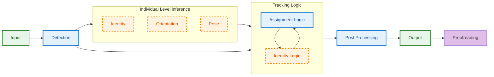
